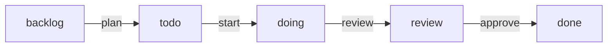

# Concepts

## The board is files

`kanbai init` creates a `.kanbai/` folder — **one directory per column**, **one Markdown card
per task**:

```
.kanbai/
├── config.toml
├── backlog/
│   └── 004-add-oauth-login.md
├── todo/
├── doing/
├── review/
├── done/
└── archive/
```

Moving a card between columns is literally moving its file between folders, so every change
is a clean, reviewable git diff. There is no database and no external service.

## Cards

Each card is a Markdown file with a YAML frontmatter header followed by a free-form body:

```markdown
---
id: "004"
title: Add OAuth login
status: backlog
priority: high
type: feature
order: 1
labels: [auth, backend]
deps: []
---

## Description
Support "Sign in with Google".

## Acceptance criteria
- [ ] OAuth flow works end to end
```

!!! warning "Manage cards through the CLI"
    The `kanbai` CLI keeps the frontmatter valid and in sync with the folder a card lives in.
    Don't hand-edit card files — use [`kanbai edit`](cli.md#edit), [`move`](cli.md#move), and
    friends instead.

| Field | Meaning |
|-------|---------|
| `id` | Sequential, zero-padded id (`001`, `002`, …), assigned on creation. |
| `title` | The card's title. Also drives the file name (`<id>-<slug>.md`). |
| `status` | The column the card is in; kept in sync with the folder. |
| `priority` | `low`, `medium`, or `high`. |
| `type` | A single structured category — see [Card type](#card-type) below. Omitted when unset. |
| `version` | A free-form release marker — see [Release version](#release-version) below. Omitted when unset. |
| `order` | Position within the column. |
| `labels` | Free-form tags, used for filtering in the UI. |
| `deps` | Ids of cards that **block** this one until they are finished. |

### Card type

`type` is a single structured category per card — `feature`, `bug`, `refactor`, `chore`,
`docs`, or `spike` by default — distinct from `labels`, which are free-form and can be several
per card. It's optional: cards created before this field existed, or left untyped, simply omit
it.

Set it with `-t`/`--type` on [`add`](cli.md#add) or [`edit`](cli.md#edit); it's shown in
`show`/`list`/`--json`, filterable and sortable in the CLI and the [web UI](web-ui.md), and
rendered as a colored badge on cards. The list of valid types — and optional per-type color
overrides — is configured via [`[types]` in `config.toml`](configuration.md#types).

### Release version

`version` is a free-form marker (e.g. `v1.2.0`) with no validation or configured list — unlike
`type`, it's expected to grow with every release, so a fixed list wouldn't make sense. Set it
directly with `-v`/`--version`, or let [`kanbai close-sprint --version <v>`](cli.md#close-sprint)
stamp it on every card archived from `done` in one go, so the archive later shows which release
shipped each card.

## The sprint workflow

Cards flow through five columns:

| Column | Meaning |
|--------|---------|
| `backlog` | Everything to do eventually. **New cards land here.** |
| `todo` | The current **sprint** — what's planned for right now. |
| `doing` | In progress. |
| `review` | Finished, awaiting **your** approval. |
| `done` | Approved and complete. |

The key idea: [`kanbai next`](cli.md#next) only reads the **sprint** (`todo`), never the
backlog. So you can pile future work into the backlog freely; the agent won't touch it until
you **plan** it into the sprint with [`kanbai move <id> todo`](cli.md#move) (or the UI's
*Plan sprint* button).



### Finish → review → approve

When the agent finishes a card it runs [`kanbai review <id>`](cli.md#review), which moves the
card to `review` and **stops**. It never runs `kanbai done`. Approving is a human step: you
inspect the work and run [`kanbai done <id>`](cli.md#done) to move it to `done`. This keeps a
human in the loop by default.

### Closing a sprint

[`kanbai close-sprint`](cli.md#close-sprint) archives the `done` cards and (optionally) resets
the active columns back to the backlog, so you can plan the next round from a clean slate. It
refuses to run while cards are still in `review`, so unapproved work is never silently archived
or moved.

## Dependencies

A card can list other card ids in `deps`. While any of those are unfinished, the card is
**blocked**: `kanbai next` skips it (even if it sorts first) and the UI shows a 🔒 indicator.
Once every dependency reaches `done`, the card becomes actionable again.

## Priorities, order, and WIP

- **Priority** (`low`/`medium`/`high`) is shown throughout the CLI and UI and can be used to
  [sort a column](web-ui.md#sorting-the-backlog).
- **Order** controls the position of a card within its column; `kanbai next` respects it.
- **WIP limits** can be set per column in [`config.toml`](configuration.md#wip); the CLI
  and UI warn (but never block) when a column exceeds its limit.

## Archive

Archiving a card ([`kanbai archive`](cli.md#archive) or the UI) moves it to `.kanbai/archive/`
and records the column it came from, so [`kanbai restore`](cli.md#restore) can put it back
where it was. The archive is off to the side — it never shows up in the board or in `next`.
