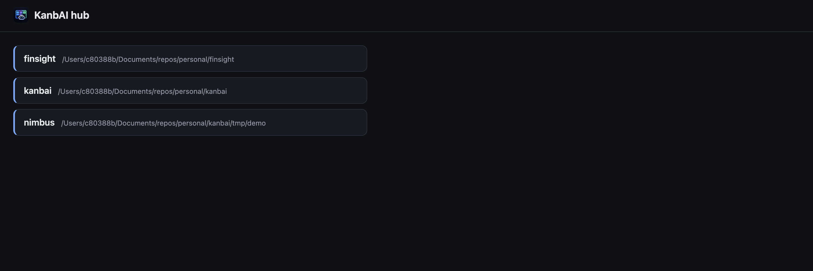
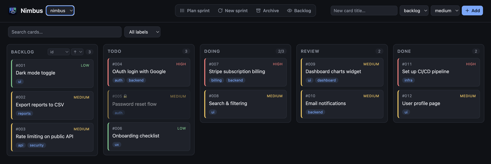

# Multi-board hub

Working across several projects? The **hub** serves all of their boards from one place, on a
single port, with a board switcher — no more one server per project.

## Install globally

Since the hub spans projects, install KanbAI **globally** rather than into a single project
(and include the [`ui` extra](installation.md#the-web-ui-extra)):

```bash
pipx install 'kanbai[ui]'
# or run it without installing anything:
uvx --from 'kanbai[ui]' kanbai hub
```

## Register your boards

Each board must already have a `.kanbai/` folder — run [`kanbai init`](cli.md#init) there
first. Then register it with the hub:

```bash
kanbai hub add ~/projects/api          # named after `[board] name` in its config.toml
kanbai hub list                        # show registered boards
kanbai hub remove api                  # unregister
```

## Serve them

```bash
kanbai hub                     # serve all registered boards; opens a landing to pick one
kanbai hub --port 9000 --no-browser
```

The hub root is a landing page that lists every registered board:



Each board is served at `/b/<name>/`, and a **board switcher** in the top bar lets you jump
between boards without leaving the page:



## Where the registry lives

The list of registered boards is stored in `~/.kanbai/boards.toml`. Override the location by
setting the `KANBAI_HOME` environment variable (handy for tests or isolated setups):

```bash
KANBAI_HOME=/tmp/kanbai-home kanbai hub list
```
