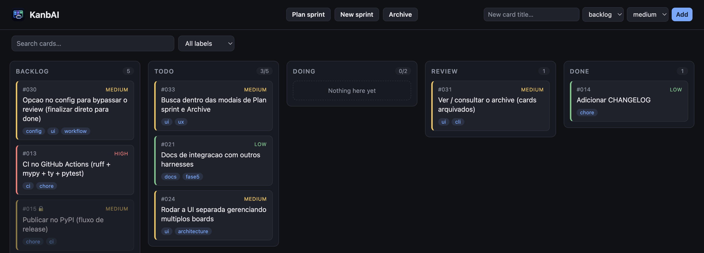

# KanbAI

A **file-based Kanban board** that lives in your repository, built for
[Claude Code](claude-code.md) and other [AI coding harnesses](other-harnesses.md) — and for
humans too. The board is plain Markdown files under `.kanbai/`, driven by a simple `kanbai`
CLI and a local web UI. Installed and invoked as `kanbai`.



## Why KanbAI

- **The board lives in your repo.** One Markdown card per task, one folder per column —
  git-friendly, diffable, no external service, no database.
- **Your agent drives it.** `kanbai init` installs a rule + skills so Claude Code picks the
  next task, implements it, and moves it across the board while you review.
- **You stay in control.** Finished work waits in `review` for your approval, and a friendly
  local web UI lets you watch and manage everything live.

## Get started in 30 seconds

```bash
pip install kanbai                       # or: uv add --dev kanbai
kanbai init                              # scaffold .kanbai/ + Claude integration
kanbai add "Build the login screen" -p high   # lands in the backlog
kanbai move 001 todo                     # plan it into the sprint
kanbai list                              # show the board
```

Then open a Claude Code session and ask it to *“work through the KanbAI board”*.

<div class="grid cards" markdown>

- :material-download: **[Installation](installation.md)** — install with pip, uv, or pipx/uvx.
- :material-lightbulb-on: **[Concepts](concepts.md)** — columns, the sprint workflow, dependencies.
- :material-console: **[CLI reference](cli.md)** — every command, flag by flag.
- :material-robot: **[Working with Claude Code](claude-code.md)** — the one-card-at-a-time loop.
- :material-monitor-dashboard: **[Web UI](web-ui.md)** — the local board with live updates.
- :material-view-grid-plus: **[Multi-board hub](hub.md)** — all your projects on one port.

</div>

## License

KanbAI is released under the [MIT License](https://github.com/rennancockles/kanbai/blob/main/LICENSE).
