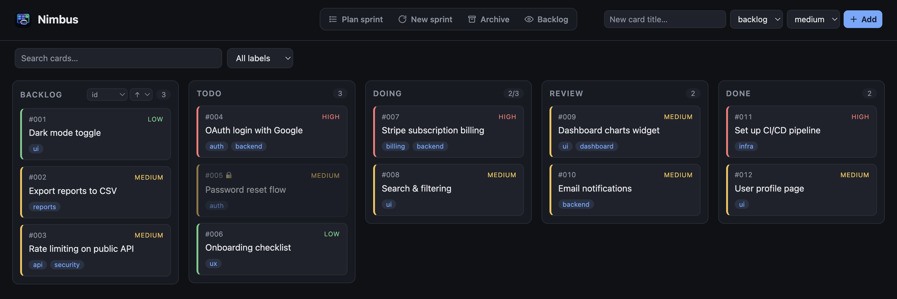
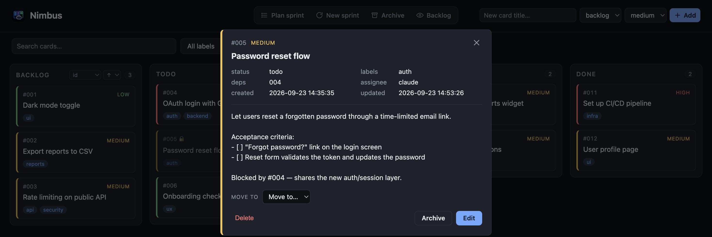
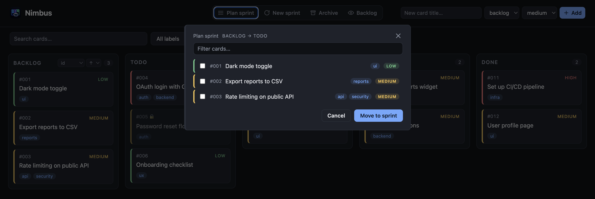
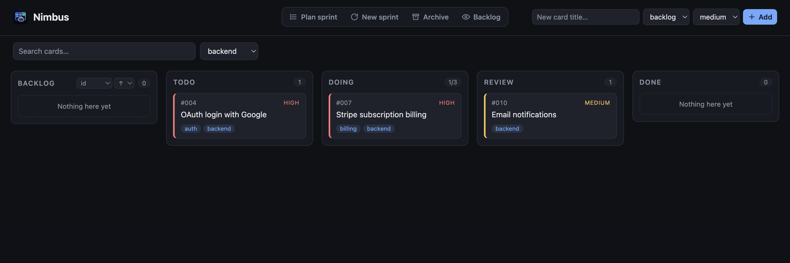
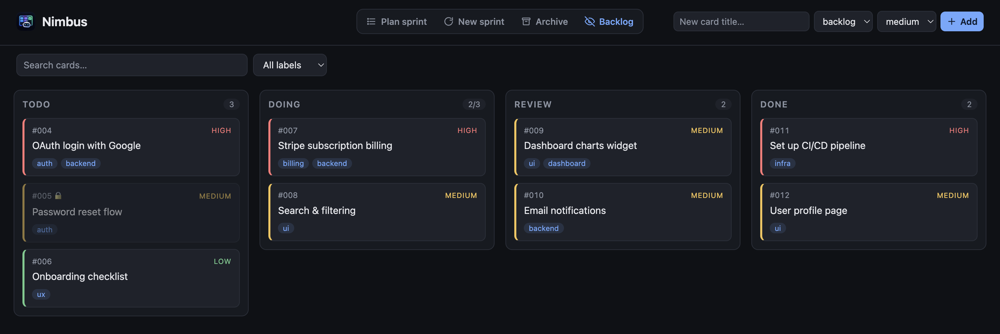

# Web UI

KanbAI ships a friendly local web UI (FastAPI + HTMX, with all assets vendored so it works
**offline**). It needs the [`ui` extra](installation.md#the-web-ui-extra).

```bash
kanbai ui                    # serve the board and open your browser
kanbai ui --port 9000 --no-browser
kanbai ui --reload           # auto-restart on code changes (development)
kanbai ui --poll             # for sandboxes/containers without OS file events
```



## What you can do

- **View the board** and **create, edit, move, archive, or delete** cards.
- **Drag-and-drop** cards between columns (the new order is persisted), or move from a card's
  detail modal.
- **Plan a sprint** — move several backlog cards into `todo` at once — and **close the current
  sprint** (archive done cards, optionally reset the active columns, optionally stamp a
  release version).
- **Search** cards and **filter by label or [type](concepts.md#card-type)**.
- Browse archived cards, click one to see its full detail, and **restore** it.
- See **WIP-limit** and **blocked-by-dependency** indicators.

## Creating a card

The **New card** button opens a modal with every field — title, column, priority,
[type](concepts.md#card-type), labels, and description — so a card can be created fully formed
in one step.

## Card details

Click any card to open its details — description and acceptance criteria, labels,
dependencies, type, and release version — and **move**, **edit**, **archive**, or **delete**
it right from the modal.



## Planning a sprint

The **Plan sprint** button opens a picker of your backlog cards — check the ones you want and
move them into the sprint (`todo`) in one go.



## Search and filter

Use the search box and the label filter to focus the board on what matters right now.



## Live updates

The UI subscribes to the board over **Server-Sent Events**. When Claude (or you) moves a card
from the CLI in another terminal, the board updates in place — no refresh needed.

!!! note "Sandboxes and containers"
    Live updates rely on OS file-change events. In environments that don't deliver them
    (some containers, network mounts), start the UI with `--poll` to fall back to polling.

## Notifications

KanbAI notifies you — with the platform's default sound — the moment a card reaches
`review` (or `done`, on boards with no `review` column) and whenever that move leaves the
sprint with no actionable card left to pick up. There's no background process to keep
running: the notification fires as part of the move itself, whether you drag the card here
in the web UI or run `kanbai review <id>`/`kanbai done <id>` from a terminal — even with no
web UI open at all.

Two channels, checked independently on every qualifying move:

- **Native desktop notification** (macOS Notification Center, Linux via `notify-send`'s dbus
  service, Windows toast). On by default. No credentials, no external service.
- **[ntfy](https://ntfy.sh) push**, off by default — set `ntfy_topic` in
  [`config.toml`](configuration.md#notifications) to also push to the public ntfy.sh server.
  Reaches your phone (via the ntfy app) or any device subscribed to that topic, not just this
  machine. ntfy.sh needs no signup or token — the topic name itself is the only thing gating
  who receives it, so pick something that isn't easily guessable.

A flaky or offline ntfy.sh never blocks the move that triggered it — a failed push is
silently skipped rather than raised. Every notification title is prefixed with the board's
name, so running several boards side by side doesn't mix up which one needs your attention.

!!! warning "Native notifications need a signed executable on macOS"
    macOS only allows **signed** executables to post notifications via Notification Center.
    A plain `python3` from Homebrew (or most `pip`/`uv` installs) is unsigned, so native
    notifications silently do nothing there — no error, just no popup. The
    [python.org installer](https://www.python.org/downloads/macos/) ships a signed
    framework build that does work; otherwise, the [ntfy](https://ntfy.sh) channel above
    is unaffected by this and a reliable fallback on macOS.

Don't want the native channel? Turn it off in
[`config.toml`](configuration.md#notifications).

## Sorting the backlog

The backlog column has a small sort control in its header. Pick a key (**id**, **priority**,
**type**, or **title**) and a direction (**↑** ascending / **↓** descending); the new order is
written back to the cards, so it sticks everywhere — including the CLI. Ascending priority
reads `low → medium → high`; use **↓** to put the highest priority first.

## Closing a sprint

The **Close sprint** button archives every `done` card and, optionally, sends the active
columns back to the backlog — with an optional release **version** stamped on every archived
card, so the archive later shows which release shipped it. It refuses to run (and shows an
alert in the modal) while any card is still in `review`, so unapproved work is never silently
archived or moved.

## Hiding the backlog

Use the **eye toggle** in the top bar to hide the backlog column and give the sprint columns
the full width. The choice is remembered in your browser.



## Multiple projects

To watch several projects at once from a single server, use the
[multi-board hub](hub.md).
